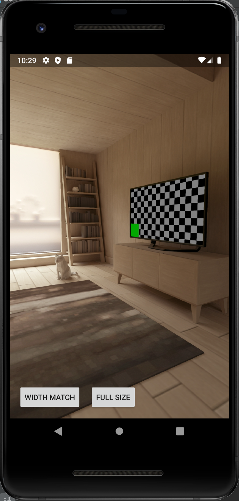
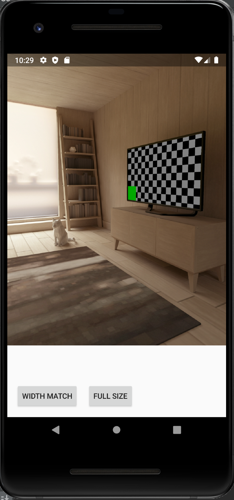

# How to programmatically control Preview size of your camera app

It's been a while since I posted an article about how we take a photo using Camera2 API. Today I'm going to share the way to control the screen size of the preview.

First, let me go through the necessary steps to configure the preview screen. Then I will explain two camera app examples -- the one that has a full-screen preview and the other that has the preview which fits the width of a screen.


## Step by step to understand configuring the preview screen

We configure the preview size right after Camera Manager is instantiated and SurfaceTexture, where the preview gets rendered, is ready.

```kotlin
// CameraView.kt
/**
* Should be called after Camera Manager and SurfaceTexture are ready
*/
fun openCamera() {
    // Step 1 Check the dimension rotation
    val isDimensionSwapped = isDimensionSwapped()

    // Step 2 Setup the preview Size and set it to previewSurface
    val previewSize = setupPreviewSize(it, isDimensionSwapped)
    previewSurface?.setDefaultBufferSize(previewSize.width, previewSize.height)

    // Step 3 Update the PreviewTexture aspect ratio
    updateAspectRatio(previewSize, isDimensionSwapped)

    // Step 4 Transform scale and rotation of the view if necessary
    configureTransform(previewSize, width, height)

    // Open Camera
    // ...
}
```

We should configure the preview size before start capturing, so `openCamera` is the best place to set up the view. Let's dive into each step.

### Step 1. Check the dimension rotation

We first need to pay attention to the screen rotation. Sometimes a camera sensor on a device is not attached in a way aligned with the screen orientation. So we always need to make sure if we need to swap preview's width and height. Here's a code to check this:

```kotlin
private fun isDimensionSwapped(): Boolean {
    val activity = getActivity(context)
    val displayRotation = activity?.windowManager?.defaultDisplay?.rotation ?: 0
    val sensorOrientation = characteristics.get(CameraCharacteristics.SENSOR_ORIENTATION)
    var swappedDimensions = false
    when (displayRotation) {
        Surface.ROTATION_0, Surface.ROTATION_180 -> {
            if (sensorOrientation == 90 || sensorOrientation == 270) {
                swappedDimensions = true
            }
        }
        Surface.ROTATION_90, Surface.ROTATION_270 -> {
            if (sensorOrientation == 0 || sensorOrientation == 180) {
                swappedDimensions = true
            }
        }
        else -> Toast.makeText(context, "rotation error", Toast.LENGTH_LONG).show()
    }
    return swappedDimensions
}
```

### Step 2. Setup the preview Size
In the next step, we set up the preview size by checking the supported Capture screen sizes and picking one of them.
Here's what we are doing under `setupPreviewSize`

```kotlin
setupPreviewSize(camera: Camera, isDimensionSwapped: Boolean) {
            val activity = getActivity(context)
            // Step 2-a. Pick the largest supported capture screen
            val largest = camera.getCaptureSize()

            val displaySize = Point()
            activity?.windowManager?.defaultDisplay?.getRealSize(displaySize)

            // Step 2-b. Pick the preview size
            return if (isSwappedDimension) {
                camera.getOptimalPreviewSize(
                    height,
                    width,
                    displaySize.y,
                    displaySize.x,
                    largest)
            } else {
                camera.getOptimalPreviewSize(
                    width,
                    height,
                    displaySize.x,
                    displaySize.y,
                    largest)
            }
}
```

### Step 2-a. Pick one capture size
Usually, a device supports multiple capture sizes. We use the capture size to dictates the width and height of the preview. It is important to note that the preview size should be smaller than the capture size. Larger the better quality the resolution will be but also consumes more memory for the buffering.  

`CameraCharacteristics` returns many attributes of a camera device and we can query the stream configuration map with key `SCALER_STREAM_CONFIGURATION_MAP`. The supported Capture screen sizes vary depending on the output format and can be looked up with the method called `getOutputSizes`. For example, if you want to look supported size for JPEG format(which is the commonly supported format in many devices) then the code would be like:

```kotlin
private val characteristics: CameraCharacteristics =
        cameraManager.getCameraCharacteristics(cameraId)
val supportedSizes: Size[] =
        cameraCharacteristics.get(CameraCharacteristics.SCALER_STREAM_CONFIGURATION_MAP).getOutputSizes(ImageFormat.JPEG)
```

With Pixel3, Supported capture sizes for JPEG format are below.

```

```

You have to pick one of them depending on your use case. I'll explain how to choose one in examples later on.

### Step 2-b. Adjust the preview size to fit the chosen capture size
Based on the capture size you have picked, we have to configure the preview size.  
First of all we access `CameraCharacteristics` again to get the list of supported preview sizes. We can acquire the list of SurfaceTexture like this:

```kotlin
val supportedPreviewSizes = characteristics.get(CameraCharacteristics.SCALER_STREAM_CONFIGURATION_MAP).getOutputSizes(SurfaceTexture::class.java)
```

Then we look for the resolutions that have the same aspect ratio as the chosen capture size.  
The code below represents the process of choosing the right preview size.

```kotlin
fun getOptimalPreviewSize(isDimentionSwapped: Boolean) {
    val capturedSize = getCapturedSize()
    val aspectRatio: Size = if(isDimentionSwapped) {
      Size(capturedSize.height, capturedSize.width)
    } else {
      Size(capturedSize.width, capturedSize.height)
    }

    val bigEnough = ArrayList<Size>()

    // maxPreviewWidth and maxPreviewHeight should be smaller than the screen size or the defined value
    for (option in supportedPreviewSizes) {
        if (option.width <= maxPreviewWidth && option.height <= maxPreviewHeight &&
            option.height == option.width * aspectRatio.h / aspectRatio.w) {
              bigEnough.add(option)
        }
    }

    // Finally pick the smallest one by area, because usually a preview does not require high resolution.
    return Collections.min(bigEnough, ComparableByArea())
}

// Comparison logic
private class ComparableByArea : Comparator<Size> {
    override fun compare(o1: Size, o2: Size): Int {
        return (o1.height * o1.width) - (o2.height * o2.width)
    }
}
```

Finally, you set this preview size to TextureView's surface buffer so that it renders correctly.

```
previewSurface?.setDefaultBufferSize(previewSize.width, previewSize.height)
```

### Step 3. Update the PreviewTexture aspect ratio
Now that we have the preview size defined, we need to adjust the aspect ratio of TextureView so that the preview does not distort. In the code below, we have a wrapper class of `TextureView` which we can set the aspect ratio to. We re-render TextureView by `requestLayout()`.  

(Note that if your camera app is fit to full screen, then you don't have to update the aspect ratio because the preview size and the screen size usually match.)

```kotlin
// AutoFitTextureView.kt

fun setAspectRatio(width: Int, height: Int) {
    ratioWidth = width
    ratioHeight = height
    // force updating the view
    requestLayout()
}

override fun onMeasure(widthMeasureSpec: Int, heightMeasureSpec: Int) {
    super.onMeasure(widthMeasureSpec, heightMeasureSpec)
    val width = MeasureSpec.getSize(widthMeasureSpec)
    val height = MeasureSpec.getSize(heightMeasureSpec)
    if (ratioWidth == 0 || ratioHeight == 0) {
        setMeasuredDimension(width, height)
    } else {
        if (width < height * ratioWidth / ratioHeight) {
            setMeasuredDimension(width, width * ratioHeight / ratioWidth)
        } else {
            setMeasuredDimension(height * ratioWidth / ratioHeight, height)
        }
    }
}
```

### Step 4. Transform scale and rotation of the view if necessary

One last step, we need to flip, rotate, or scale the preview. However, this is only necessary in case your camera app supports the screen rotation. If your app only supports Portrait(which I think is enough for most use cases), you can skip this process. I brought this logic from the sample code of Google, so I won't explain it too much. Instead, I'll visualize what kind of calculation happening here.

## Examples

Now that you have some background of how the preview calculation works, let me give you two examples.

### Example 1: Full-Screen Camera App

  

To create the app that has the full screen, you need to pick the Capture Size that fits the screen ratio. We fetch the supported Capture size as explained in Step 1. Then in Step 2, we sort the `supportedSizes` by aspect ratio by the calculation below.

(figure)

Here's the code that represents the formula above.

```kotlin
private class ComparableByRatio(private val ratio: Double) : Comparator<Size> {
    override fun compare(o1: Size, o2: Size): Int {
        val r = abs((o2.width.toDouble() / o2.height) - ratio) - abs((o1.width.toDouble() / o1.height) - ratio)
        return r.compareTo(0)
    }
}
```

```kotlin
// CameraView.kt

// Called at OnCreate
override fun onAttachedToWindow() {
    super.onAttachedToWindow()
    val cameraManager = context.getSystemService(Context.CAMERA_SERVICE) as CameraManager
    val point = Point()
    // Get the screen size
    getActivity(context)?.windowManager?.defaultDisplay?.getRealSize(point)
    camera = Camera.initInstance(cameraManager, "0", point)
    }
  ...
}

// Camera.kt

class Camera (
    private val cameraManager: CameraManager,
    private val cameraId: String,
    screenSize: Point? = null,
) {
    private val screenRatio: Double = screenSize?.let { it.y.toDouble().div(it.x) } ?: 1.0
    ...
    val comparator = ComparableByRatio(screenRatio)

    // Pick the supported capture size that has closest aspect ratio to the screen size
    val fullScreenSize = supportedSizes.asList()
        .maxWith(comparator)
}
```

In Step 3, set the aspect ratio of the screen to the preview.

```kotlin
private fun updateAspectRatio(screenSizeMode: ScreenSizeMode, isSwappedDimension: Boolean) {
  val displaySize = Point()
  // Check the screen size
  activity?.windowManager?.defaultDisplay?.getSize(displaySize)
  if(isSwappedDimension) {
      previewTextureView.setAspectRatio(displaySize.x, displaySize.y)
  } else {
      previewTextureView.setAspectRatio(displaySize.y, displaySize.x)
  }
```

By the way, you can even skip this step if you use `TextureView` instead of `AutoTextureView` and set `match_parent` params.

```xml
<LinearLayout xmlns:android="http://schemas.android.com/apk/res/android"
    android:orientation="vertical" android:layout_width="wrap_content"
    android:layout_height="wrap_content">

<!--
    <com.tomoima.cameralayout.camera.AutoFitTextureView
       android:id="@+id/camera_texture"
        android:layout_width="wrap_content"
        android:layout_height="wrap_content" />
-->
    <TextureView
        android:id="@+id/camera_texture"
        android:layout_width="match_parent"
        android:layout_height="match_parent"
</LinearLayout>
```

Step 4, there's nothing special we need to do. You should see the full-screen preview now.

### Example 2: Portrait Camera app that has the preview which fits the width of the screen

  

Let's choose one capture size as we did in Example 1. You can pick whatever you want, but my advice is to choose the one that has the largest size so that it covers most of the preview size.

The code would look like this:

```kotlin
private class ComparableByArea : Comparator<Size> {
    override fun compare(o1: Size, o2: Size): Int {
        return (o1.height * o1.width) - (o2.height * o2.width)
    }
}
```

And here's how we apply this Comparator:

```kotlin

// Camera.kt

class Camera (
    private val cameraManager: CameraManager,
    private val cameraId: String,
    screenSize: Point? = null,
) {
    val comparator = ComparableByArea()

    // Pick the largest capture size from the supported capture size
    val captureSize = supportedSizes.asList()
        .maxWith(comparator)
}
```

Based on the capture size you picked, we calculate the size of the preview with the logic I explained in Step 2. Finally, we adjust the Preview aspect ratio. You can see the difference between a Full-screen camera. We are using `previewSize`, not the display size.

```kotlin

private fun updateAspectRatio(screenSizeMode: ScreenSizeMode, isSwappedDimension: Boolean) {
    if(isSwappedDimension) {
        previewTextureView.setAspectRatio(previewSize!!.height, previewSize!!.width)
    } else {
        previewTextureView.setAspectRatio(previewSize!!.width, previewSize!!.height)
    }
}
```

# Wrap up

In this post, I illustrated the step to configure the preview of Camera. It doesn't look straightforward at first glance, but once you understand how it behaves, you will get full control of how to design your camera app.

